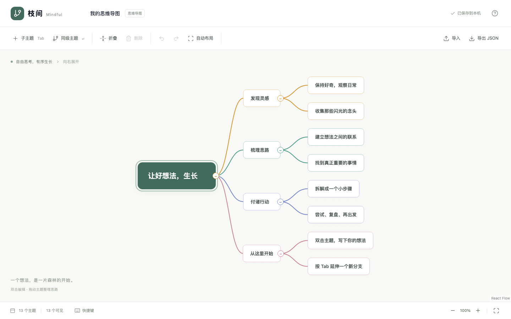
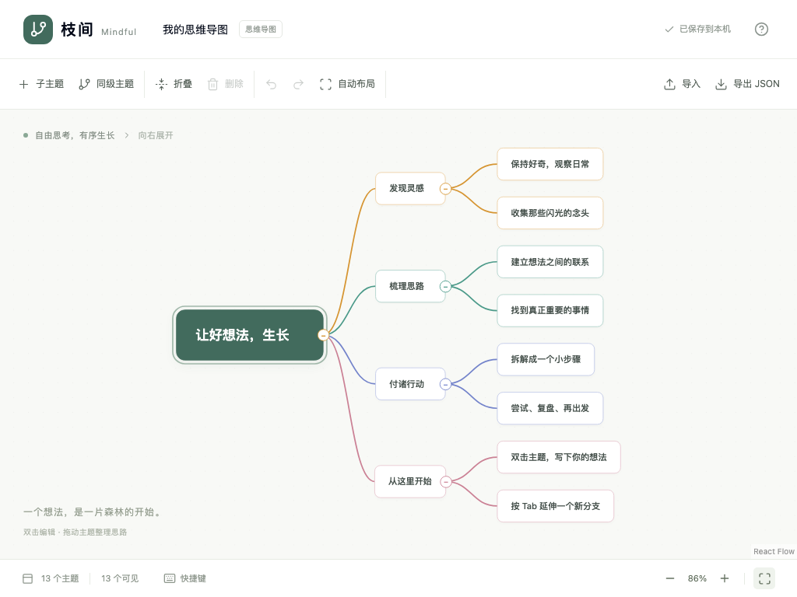
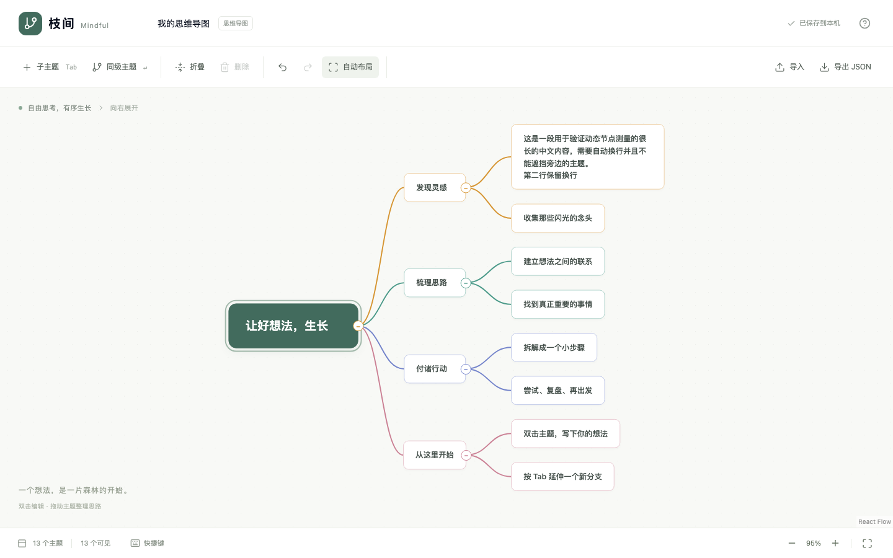

# kanx-mindmap — 基础功能验收报告

验收日期：2026-09-19（Asia/Singapore）。环境：macOS、Node.js 24.14.0、pnpm 10、Next.js 16.2.0、React 19.1.0。浏览器自动化使用 Playwright 1.63.0 / Chromium 153，页面地址为 `http://localhost:3001`；另在 Codex 内置真实浏览器进行视觉及根主题编辑检查。

## 结果

| 检查             | 结果                                                                    |
| ---------------- | ----------------------------------------------------------------------- |
| `pnpm lint`      | 通过，无错误或警告                                                      |
| `pnpm typecheck` | 通过                                                                    |
| `pnpm test`      | 13/13 通过                                                              |
| `pnpm test:e2e`  | 11/11 通过，最终完整运行 44.6 秒                                        |
| `pnpm build`     | 通过，首页静态预渲染成功                                                |
| 浏览器运行错误   | 全部 E2E 均检查 `pageerror`，未发现错误；人工浏览器控制台无 error       |
| 视觉检查         | 1440×900、1024×768 页面主题、工具栏和连线清晰，无节点重叠或横向页面溢出 |

已确认范围内没有遗留失败项。测试源码位于 `tests/model.test.ts` 和 `tests/e2e/editor.spec.ts`；HTML 报告为本地生成的 `playwright-report/index.html`，可通过 `pnpm exec playwright show-report` 打开。

## 功能覆盖

| 能力                   | 验证方式与结果                                                       |
| ---------------------- | -------------------------------------------------------------------- |
| 单根向右展开、自动布局 | 检查父子 X 坐标、兄弟 Y 顺序与不同尺寸节点不重叠；通过               |
| 新增子主题 / 同级主题  | 按钮、Tab、Enter，新增位置及 parentId/children 正确；通过            |
| 删除与根保护           | 删除完整子树，根不可删除；删除后选择父主题；通过                     |
| 文本编辑               | 双击、F2、连续编辑、提交、取消、空白归一化、多行、失焦提交；通过     |
| 中文输入               | 中文文本与 composition 事件模拟，组合输入中的 Enter 不提前提交；通过 |
| 折叠 / 展开            | 隐藏后代但保留数据，折叠后恢复；通过                                 |
| 拖拽排序               | 鼠标按下、移动、释放，插入线预览与兄弟数组顺序正确；通过             |
| 拖拽改父级             | 主题中心高亮，移动子树、拖入折叠主题后展开；通过                     |
| 非法拖拽               | 禁止根移动、自身后代循环；空白释放恢复布局；通过                     |
| 撤销 / 重做            | 按钮及键盘，增删改、折叠、移动、整图导入均支持；通过                 |
| 键盘导航               | 父、子、前后兄弟导航；禁用 React Flow 默认方向键自由移动坐标；通过   |
| 画布                   | 缩放、恢复 100%、拖动平移、适应画布；通过                            |
| 布局动画               | 200ms 节点过渡；减少动态效果下 transition 为 0s；通过                |
| 本地保存               | 提交后自动保存，刷新恢复；退出页面时补写待保存数据；通过             |
| 保存错误               | 模拟 localStorage 写失败，提示可见且仍可编辑、导出；通过             |
| 损坏本地数据           | 显示读取错误并回退示例；通过                                         |
| JSON                   | 导出实际下载文件、有效导入、无效导入保留内容、导入撤销；通过         |
| 树数据校验             | 唯一根、父子一致、循环、重复引用、缺失/孤立节点、版本；通过          |
| 异步边界               | 过期布局失效；忽略已删除节点的选择/编辑事件；通过                    |
| 任意节点标识           | 导入 ID 与布局内部 ID 隔离；通过                                     |

## 规模验证

使用单根、10 个一级分支、总量分别为 100 / 300 / 500 的导图，验证导入显示、缩放、折叠、根主题编辑和重新展开。以下为最终一次本机开发服务器的浏览器实测：

| 节点数 | 导入至可见节点数量收敛 | 折叠至仅根主题 |
| ------ | ---------------------: | -------------: |
| 100    |               1,168 ms |         125 ms |
| 300    |               1,410 ms |         271 ms |
| 500    |               1,631 ms |         526 ms |

导入数字包括文件输入、浏览器渲染及测试脚本固定 800ms 等待，并非纯 ELK 耗时。折叠数字衡量可见 DOM 数量收敛，不是动画帧率或延迟分位数。全部规模均完成编辑与展开，无运行错误。

定位并移除了 ELK 模型顺序比较阶段在宽树上的高开销：使用规范树 DFS 顺序生成临时 Y 排序种子，配置 INTERACTIVE crossing minimization；最终坐标仍由 ELK 计算。独立 500 节点布局验证从约 13 秒降至约 0.6 秒，浏览器完整导入显示从约 14 秒降至约 1.6 秒。另以 500 个不同宽高节点、反向兄弟数组验证顺序和间距，防止性能优化改变业务排序。

布局仍在主线程执行，没有 Worker、局部布局或万级节点性能承诺。

## 截图

### 1440×900

### 1024×768

### 长文本与多行

## 测试边界

这次验收覆盖 Chromium 桌面基础功能与中文 composition 事件，不包含 Firefox/Safari 全套兼容、不同系统真实输入法逐一实测、触屏拖拽或长期压力测试。没有公网部署；交付页面运行于本地 3001 端口。XMind 文件兼容、协作、账号、双向布局和图像/PDF 导出不在本次范围。
